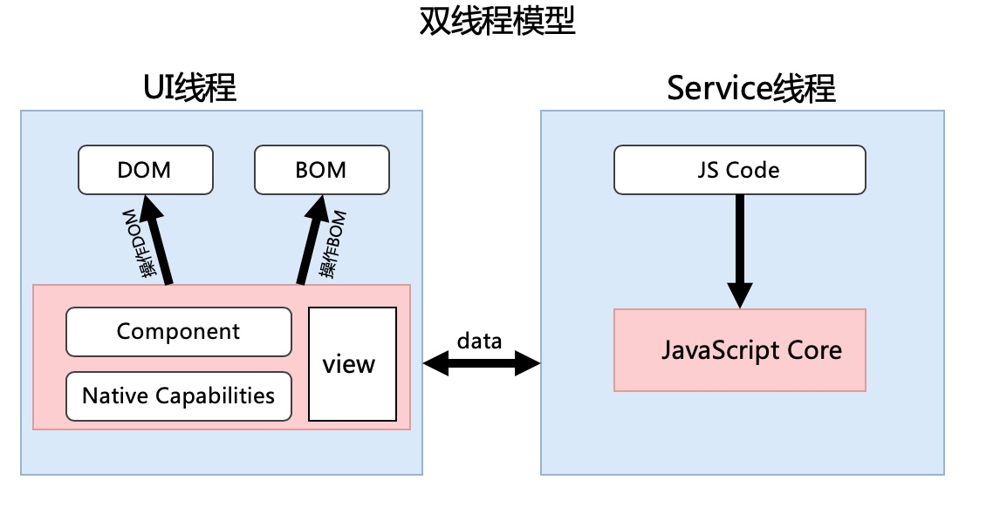
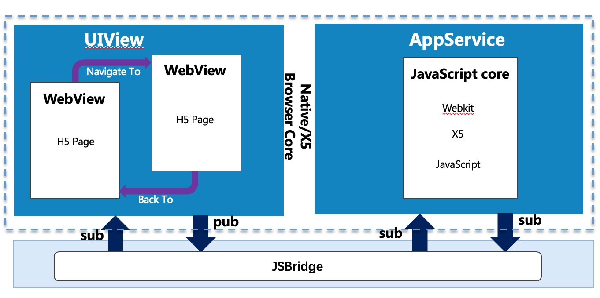

# 深入小程序系列之一:小程序核心原理及模拟

本文将介绍小程序的核心视图层逻辑层分离架构，并通过 iOS 的代码来模拟这种双线程模型。

## 什么是小程序

小程序是一种新的移动应用程序格式，是一种依赖 Web 技术，但也集成了原生应用程序功能的混合解决方案。

目前市面上小程序平台微信、支付宝、百度、头条、京东、[凡泰](https://mp.finogeeks.com)等；小程序一些特性有助于填补 Web 和原生平台之间的鸿沟，因此小程序受到了一些超级应用程序的欢迎。

- 它不需要安装，支持热更新。
- 具备多个 Web 视图以提高性能。
- 它提供了一些通过原生路径访问操作系统功能(原生接口)或数据的机制。
- 它的内容通常更值得信赖，因为应用程序需要由平台验证。
- 小程序可以分发到多个小程序平台（Web、原生应用，甚至是 OS）。这些平台还为小程序提供了入口，帮助用户轻松找到所需的应用。

## 小程序核心功能

### 分离视图层与逻辑层

在小程序中，视图层通常与逻辑层分离。

- 视图层 View 负责渲染小程序页面，包括 Web 组件和原生组件渲染，可以将其视为混合渲染。例如，Web 组件渲染可以由 WebView 处理，但 WebView 不支持某些 Web 组件渲染，或者是性能受限；小程序还依赖于某些原生组件，例如地图、视频等。
- 逻辑层 Service 是用主要用于执行小程序的 JS 逻辑。主要负责小程序的事件处理、API 调用和生命周期管理。扩展的原生功能通常来自宿主原生应用程序或操作系统，这些功能包括拍照、位置、蓝牙、网络状态、文件处理、扫描、电话等。它们通过某些 API 调用。当小程序调用原生 API 时，它会将 API 调用传递给扩展的原生功能，以便通过 JSBridge 进一步处理，并通过 JSBridge 从扩展的原生功能获取结果。Service 为每个 Render 建立连接，传输需要渲染的数据以进一步处理。
- 如果事件由小程序页面中的组件触发，则此页面将向 Service 发送事件以进一步处理。同时，页面将等待 Service 发送的数据来重新渲染小程序页面。
- 渲染过程可被视为无状态，并且所有状态都将存储在 Service 中。

视图层和逻辑层分离有很多好处：

- 方便多个小程序页面之间的数据共享和交互。
- 在小程序的生命周期中具有相同的上下文可以为具备原生应用程序开发背景的开发人员提供熟悉的编码体验。
- Service 和 View 的分离和并行实现可以防止 JS 执行影响或减慢页面渲染，这有助于提高渲染性能。
- 因为 JS 在 Service 层执行，所以 JS 里面操作的 DOM 将不会对 View 层产生影响，所以小程序是不能操作 DOM 结构的，这也就使得小程序的性能比传统的 H5 更好。



## 小程序双线程模型模拟

~~先看一下运行结果

 

接下来我们将用 iOS 代码来模拟上述的双线程模型。首先我们来实现视图层与逻辑层的数据通讯



如上图所示，视图层与逻辑层都分别通过 JS Bridge 的 publish 和 subscribe 来实现数据的收发。

### 模拟实现

1. 视图层调用**JSBridge.publish**把事件传递给原生;参数: {eventName: '', data: {}}

   ```javascript
   //点击按钮，通知JS执行业务逻辑
   function onTest() {
     console.log('aaa')
     FinChatJSBridge.subscribe('PAGE_EVENT', function (params) {
                               document.getElementById('testId').innerHTML = params.data.title                                })
     FinChatJSBridge.publish('PAGE_EVENT', {
       eventName: 'onTest',data: {}
     })

   ```

}

````

2. 原生 view 层收到 page 的事件，把事件传递转发给 service 层处理

   ```objective-c
   if ([message.name isEqualToString:@"publishHandler"]) {
           NSString *e = message.body[@"event"];
           [self.service callSubscribeHandlerWithEvent:e param:message.body[@"paramsString"]];
       }
````

3. 原生 service 层收到原生 view 层的事件，通过 jsbridge 把事件及参数传递给视图 ervice 层执行 js 逻辑
   ```objective-c
   NSString *js = [NSString stringWithFormat:@"ServiceJSBridge.subscribeHandler('%@',%@)",eventName,jsonParam];
   [self evaluateJavaScript:js completionHandler:nil];
   ```
4. 视图 service，收到事件后，执行 JS 业务代码

   ```javascript
   var Page = {
     setData: function(data) {
       //向原生视图层发送更新数据信息
       ServiceJSBridge.publish('PAGE_EVENT', {
         eventName: 'onPageDataChange',
         data: data
       })
     },
     methods: {
       onTest: function() {
         // 执行JS方法，模拟小程序的setData，把数据更新到视图层
         Page.setData({
           title: '我来自JS代码更新'
         })
         console.log('my on Test')
       }
     }
   }
   var onWebviewEvent = function(fn) {
     ServiceJSBridge.subscribe('PAGE_EVENT', function(params) {
       console.log('FinChatJSBridge.subscribe')
       var data = params.data,
         eventName = params.eventName
       fn({
         data: data,
         eventName: eventName
       })
     })
   }
   var doWebviewEvent = function(pEvent, params) {
     // do dom ready

     if (Page.methods.hasOwnProperty(pEvent)) {
       // 收到视图层的事件，执行JS对应的方法
       Page.methods[pEvent].call(params)
     }
   }
   ```

5. 执行业务 JS 代码后，把数据更新传递给视图层去更新 UI 界面展示数据
   ```javascript
   ServiceJSBridge.publish('PAGE_EVENT', {
     eventName: 'onPageDataChange',
     data: data
   })
   ```
6. 原生 service 层收到视图 service 层的事件，把事件传递给原生视图层
   ```objective-c
   if ([message.name isEqualToString:@"publishHandler"]) {
       NSString *e = message.body[@"event"];
       [self.controller callSubscribeHandlerWithEvent:e param:message.body[@"paramsString"]];    }
   ```
7. 原生视图层把收到的事件，传递给视图 view 层
   ```javascript
    NSString *js = [NSString stringWithFormat:@"FinChatJSBridge.subscribeHandler('%@',%@)",eventName,jsonParam];
   [self evaluateJavaScript:js completionHandler:nil];
   ```
8. 视图 view 层，收到事件后，更新界面

   ```javascript
   FinChatJSBridge.subscribe('PAGE_EVENT', function(params) {
     document.getElementById('testId').innerHTML = params.data.title
   })
   ```

onWebviewEvent(function (params) {
var eventName = params.eventName
var data = params.data
return doWebviewEvent( eventName, data)
})

````

```javascript
// 首先订阅数据回调
JSBridge.subscribe('PAGE_EVENT', function(params) {
  // ... 这里对返回的数据进行处理
})
// 向JS Bridge发布数据
// eventName: 用于标识事件名
// data: 为传递的数据
JSBridge.publish('PAGE_EVENT', { eventName: 'onTest', data: {} })
````

首先需要对 WKWebView 初始化，

```object-c
    WKUserContentController *userContentController = [WKUserContentController new];
    NSString *souce = @"window.__fcjs_environment='miniprogram'";
    WKUserScript *script = [[WKUserScript alloc] initWithSource:souce injectionTime:WKUserScriptInjectionTimeAtDocumentStart forMainFrameOnly:true];
    [userContentController addUserScript:script];
    [userContentController addScriptMessageHandler:self name:@"publishHandler"];

    WKWebViewConfiguration *wkWebViewConfiguration = [WKWebViewConfiguration new];
    wkWebViewConfiguration.allowsInlineMediaPlayback = YES;
    wkWebViewConfiguration.userContentController = userContentController;

    if (@available(iOS 9.0, *)) {
        [wkWebViewConfiguration.preferences setValue:@(true) forKey:@"allowFileAccessFromFileURLs"];
    }
    WKPreferences *preferences = [WKPreferences new];
    preferences.javaScriptCanOpenWindowsAutomatically = YES;
    wkWebViewConfiguration.preferences = preferences;

    self.webView = [[WKWebView alloc] initWithFrame:self.view.bounds configuration:wkWebViewConfiguration];
    self.webView.clipsToBounds = YES;
    self.webView.allowsBackForwardNavigationGestures = YES;

    [self.view addSubview:self.webView];
    NSString *urlStr = [[NSBundle mainBundle] pathForResource:@"view.html" ofType:nil];
    NSURL *fileURL = [NSURL fileURLWithPath:urlStr];
    [self.webView loadFileURL:fileURL allowingReadAccessToURL:fileURL];
```

WKWebView 事件回调处理

```object-c
// 执行视图层事件回调
- (void)callSubscribeHandlerWithEvent:(NSString *)eventName param:(NSString *)jsonParam
{
    NSString *js = [NSString stringWithFormat:@"FinChatJSBridge.subscribeHandler('%@',%@)",eventName,jsonParam];
    [self evaluateJavaScript:js completionHandler:nil];


}

- (void)evaluateJavaScript:(NSString *)javaScriptString completionHandler:(void(^)(id result,NSError *error))completionHandler
{

    [self.webView evaluateJavaScript:javaScriptString completionHandler:completionHandler];
}

#pragma mark - WKScriptMessageHandler
// 视图层JSBridge请求接收处理
- (void)userContentController:(WKUserContentController *)userContentController didReceiveScriptMessage:(WKScriptMessage *)message
{
    if ([message.name isEqualToString:@"publishHandler"]) {
        NSString *e = message.body[@"event"];
        [self.service callSubscribeHandlerWithEvent:e param:message.body[@"paramsString"]];
    }
}
```

### 视图层代码

```javascript
function onTest() {
  console.log('aaa')
  FinChatJSBridge.subscribe('PAGE_EVENT', function(params) {
    document.getElementById('testId').innerHTML = params.data.title
  })
  FinChatJSBridge.publish('PAGE_EVENT', {
    eventName: 'onTest',
    data: {}
  })
}
```

```html
<div id="testId">我来自视图层!</div>
<input type="button" value="调用JS逻辑层setData" style="border-radius:15px;background:#ed0c50;border: #EDD70C;color: white;font-size: 14px; width: 80%;" onclick="onTest();" />
```

### 逻辑层代码

```javascript
// page 对像模拟
var Page = {
  setData: function(data) {
    ServiceJSBridge.publish('PAGE_EVENT', {
      eventName: 'onPageDataChange',
      data: data
    })
  },
  methods: {
    onTest: function() {
      Page.setData({
        title: '我来自JS代码更新'
      })
      console.log('my on Test')
    }
  }
}
var onWebviewEvent = function(fn) {
  ServiceJSBridge.subscribe('PAGE_EVENT', function(params) {
    var data = params.data,
      eventName = params.eventName
    fn({
      data: data,
      eventName: eventName
    })
  })
}
var doWebviewEvent = function(pEvent, params) {
  // do dom ready
  if (Page.methods.hasOwnProperty(pEvent)) {
    Page.methods[pEvent].call(params)
  }
}
onWebviewEvent(function(params) {
  var eventName = params.eventName
  var data = params.data
  return doWebviewEvent(eventName, data)
})
```

文档中心: [Document](https://mp.finogeeks.com/mop/document/introduce/introduction/)

## 联系我们，了解更多内容


